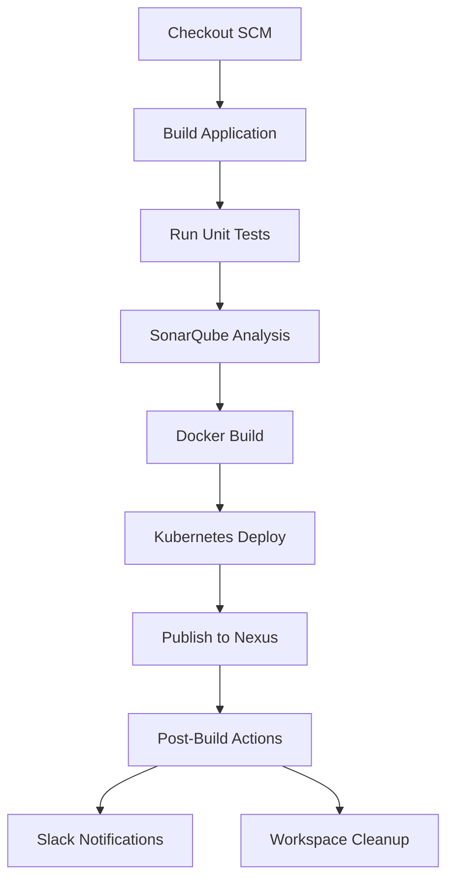

# Jenkins Pipeline Documentation

## Pipeline Overview

### Install this plugins 
**1.Timestamp**

**2.Nexus artifact uploader**

**3.Sonarqube scanner**

**4.stageview**

**5.slack notfication**

**6.Blue  ocean**
### Prerequist

**Docker**

**Kubectl**

### Enable slave

### Add sonar server 

## Add slack notfication

## Runing application 

