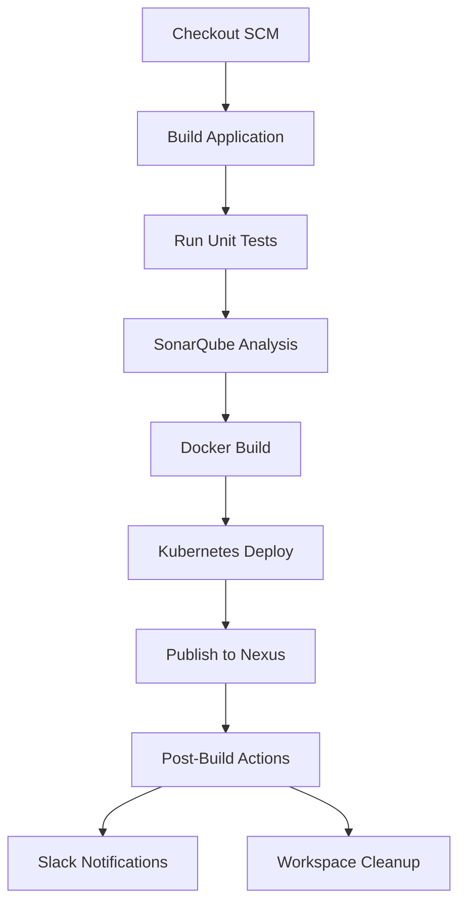

# Jenkins Pipeline Documentation

## Pipeline Overview

```mermaid
graph TD
    A[Checkout SCM] --> B[Build Application]
    B --> C[Run Unit Tests]
    C --> D[SonarQube Analysis]
    D --> E[Docker Build]
    E --> F[Kubernetes Deploy]
    F --> G[Publish to Nexus]
    G --> H[Post-Build Actions]
    H --> I[Slack Notifications]
    H --> J[Workspace Cleanup]
```

