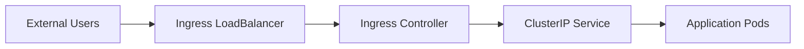

# Kubernetes Application Deployment 🚀

## Overview
Containerized application deployment using Kubernetes with:
- 5 replica deployment
- NGINX Ingress Controller
- ClusterIP service
- AWS LoadBalancer integration

## Architecture

### Configuration Files
**1.Namespace**
```yaml
apiVersion: v1
kind: Namespace
metadata:
  name: ivolve
```
**you can set as defult**
```bash
kubectl config set-context --current --namespace=ivolve 
kubectl config view --minify | grep namespace
```
**2. Deployment**
```yaml
apiVersion: apps/v1
kind: Deployment
metadata:
  name: ivolveapp
  namespace: ivolve
spec:
  replicas: 5
  template:
    spec:
      containers:
      - name: ivolve-app
        image: ibrahimelmsery1/ivolve-app
        ports:
        - containerPort: 8081
```
**3. Service**
```yaml
apiVersion: v1
kind: Service
metadata:
  name: ivolve-app-svc
  namespace: ivolve
spec:
  type: ClusterIP
  ports:
  - port: 80
    targetPort: 8081
```
**4. Ingress**
- Create target group in aws with port(30108) of nginx controller 
ingress-nginx-controller             LoadBalancer   10.109.144.126   <pending>     80:30164/TCP,443:30108/TCP   35m
- Create aws ALB(application loadd balancer) for this target group and get dns from LB
```yaml
apiVersion: networking.k8s.io/v1
kind: Ingress
metadata:
  name: ivolve_ingress
  namespace: ivolve
  annotations:
    nginx.ingress.kubernetes.io/rewrite-target: /
spec:
  ingressClassName: nginx
  rules:
  - host: ingress-173674326.us-east-1.elb.amazonaws.com
    http:
      paths:
      - path: /
        pathType: Prefix
        backend:
          service:
            name: ivolve-app-svc
            port:
              number: 80
```
### Quick Start
```bash
# Create namespace
kubectl apply -f namespace.yaml

# Deploy components
kubectl apply -f deployment.yaml
kubectl apply -f service.yaml
kubectl apply -f ingress.yaml

# Verify
kubectl get all -n ivolve
kubectl get ingress -n ivolve
```
          
